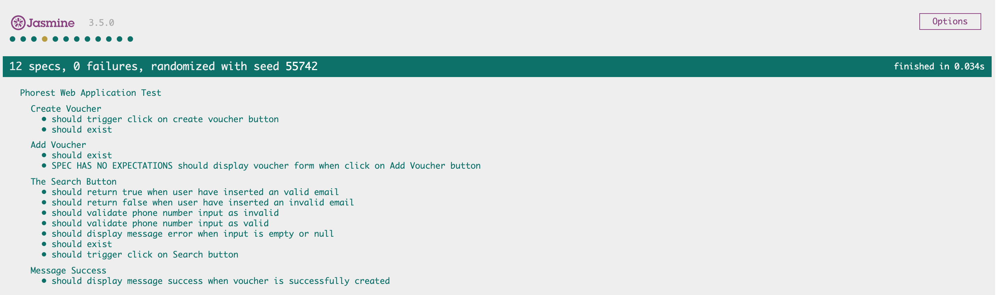

# My Tech Test Phorest

## Table of Contents
1. [**Problem description**](#problem-description)
2. [**Acceptance Criteria**](#acceptance-criteria)
  - [**For step 1**](#for-step-1)
  - [**For step 2**](#for-step-2)
  - [**Bonus Points**](#bonus-points)
3. [**Technologies Used**](#technologies-used)
    - [**Front-End Technologies**](#front-end-technologies)
    - [**Libraries/Framework Used**](#Libraries/-framework-used)
4. [**Testing**](#testing)
    - [**Automated Testing**](#automated-testing)
5. [**Deployment**](#deployment)
    - [**Local Deployment**](#local-deployment)
    - [**Remote Deployment**](#remote-deployment)
6. [**Environment Variables**](#environment-variables)
   

## Problem Description
Phorest has a platform for our customers to build their own applications on.

You are tasked with building an interface to our platform. UI (web or app) or CLI application.

The test is split into two parts. First is search for clients and the second is creating vouchers. Do
your best and see how far you get without stressing yourself too much.

Our API documentation can be found [here](https://api-gateway-dev.phorest.com/third-party-api-server/swagger-ui.html) . It’s a REST API and uses JSON. Please get in touch if
you have troubles making requests to the API.
here

We are looking for a web application, native app or command line interface - to our API.


## Acceptance Criteria

### For Step 1
You should be able to handle when there are many of the same clients returned (with the same
number or email). So if there are two clients returned for the same phone number, display both.

### For Step 2
The UI should let you input the amount you want to create the voucher for, and then display the
voucher has been created successfully.

This is about solving the problem, we have seen people use Vanilla javascript, React, iOS, Android,
Vue and others. You should look to use libraries and frameworks to do the heavy lifting if you are
comfortable with them, but use the tools you best know and can work with.

### Bonus Points
- Automated tests
- Nice UI
- Clean code
- Deploy code / give instructions on how to set up environments

##### back to [top](#table-of-contents)
***


## Technologies Used

### Front-End Technologies
<b>Built with</b>
- 
    - [HTML5](https://developer.mozilla.org/en-US/docs/Web/Guide/HTML/HTML5) - Used as the base for markup text.
- 
    - [CSS3](https://developer.mozilla.org/en-US/docs/Web/CSS/CSS3) - Used as the base for cascading styles.
- 
    - [JavaScript ES6](https://developer.mozilla.org/en-US/docs/Web/JavaScript) - Used as the base for website interaction.
- 
    - [Jasmine](https://jasmine.github.io/) - Used for Test-Driven Development (TDD).
- 
    - [jasmine-jquery](https://www.npmjs.com/package/jasmine-jquery) - Used to simplify some of the automated Jasmine tests.

### Libraries/ Framework Used
- [Bootstrap 4](https://getbootstrap.com/) - Bootstrap is a free and open-source CSS framework directed at responsive, mobile-first front-end web development
- [Moment.js](https://momentjs.com/) - Parse, validate, manipulate and display dates and times in JavaScript.
- [Jasmine](https://jasmine.github.io/) - Used for Test-Driven Development (TDD).
- [Jasmine - jQuery](https://github.com/velesin/jasmine-jquery) - It provides two extensions for the Jasmine JavaScript Testing Framework

 
##### back to [top](#table-of-contents)
***

## Testing
Automated were conducted in this project test. 

### Automated Testing
I used [Jasmine 3.5.0](https://jasmine.github.io/) in conjunction with [jasmine-jquery 2.1.1](https://github.com/velesin/jasmine-jquery) to build all automated tests (test-driven development). These tests can be found in the [testing/automated(../blob/master/Testing.md) folder.

There are **12** tests in my specs, all successfully passing, with **0** failures.



<details>
<summary><b>CLICK HERE</b> to see tests on the <b>Phorest Web Application Test</b></summary>

- describe: The Search Button
- describe: Add Voucher
- describe: Create Voucher
- describe: Message Success

</details>
<details>
<summary><b>CLICK HERE</b> to see tests on the <b>The Search Button</b></summary>

- should exist
- should trigger click on Search button
- should display message error when input is empty or null
- should return false when user have inserted an invalid email
- should return true when user have inserted an valid email
- should validate phone number input as valid
- should validate phone number input as invalid
</details>

<details>
<summary><b>CLICK HERE</b> to see tests on Add Voucher</b></summary>

- should exist
- should display voucher form when click on Add Voucher button

</details>

<details>
<summary><b>CLICK HERE</b> to see tests on Create Voucher</b></summary>

- should exist
- should trigger click on create voucher button

</details>

<details>
<summary><b>CLICK HERE</b> to see tests on Message Success</b></summary>

- should display message success when voucher is successfully created

</details>

##### back to [top](#table-of-contents)

*** 
## Deployment

My [Phorest Tech Test](https://github.com/Camila-Ribeiro/phorest-techtest-camilaRibeiro) was developed locally using **VS Code**, and all commits were pushed to **GitHub** using **Git**.

This website was deployed on GitHub pages built from the Master branch to publish the test.
To run this project locally, download the files and navigate through the index.html to start.

### Local Deployment

To run this project locally on your own system, you will need to clone this repository and need to have [GIT](https://www.atlassian.com/git/tutorials/install-git) installed and any suitable IDE.

Next, to proceed with local deployment, you can...

- **Download** this GitHub repository
    - by "*Code*" button above (beside green Gitpod button),
    - select *Download Zip*, this will download the project as a zip-file (*remember to unzip it first*).

### Remote Deployment

This site was deployed using [GitHub Pages](https://pages.github.com/) using the **master branch**.

Deployed Site:
- [https://github.com/Camila-Ribeiro/phorest-techtest-camilaRibeiro](https://github.com/Camila-Ribeiro/phorest-techtest-camilaRibeiro)

Once you have the project setup locally, you can proceed to deploy it remotely with the following steps:

1. Navigate to your GitHub repository:
    - `https://github.com/USERNAME/REPO`
2. Click on the **Settings** tab at the top:
    - `https://github.com/USERNAME/REPO/settings`
3. Scroll down on that page to the **GitHub Pages** section.
4. The first drop-down field should be **Source** with *None* preselected.
5. Select **master branch** from the list.
6. The page should refresh.
7. Scroll back down to the **GitHub Pages** section.
8. You should now have a deployed link:
    - `https://USERNAME.github.io/REPO`

**IMPORTANT NOTE**:
- Please allow a few minutes to pass before opening your newly deployed link! Clicking this link too quickly may result in a failure to build the site, causing an Error 404 page instead.

Congratulations! Your project should be deployed successfully on GitHub Pages! :tada: 

##### back to [top](#table-of-contents)

*** 


## Environment Variables
Steps to set up environmets:

1. Create `config.js` file inside `js` folder,
2. Add `<script src="assets/js/config.js"></script>` on index.html,
3. Add `config.js` file to `.gitignore` file using path `assets/js/config.js`,
4. On `config.js` file add desired variables as per example below:
    ```
    var env = {
        url  : "",
        username : "",
        password  : ""
    };
    ```
5. On `main.js` file pass the varibles as per example below:
     ```
    let url = env.url;
    let username = env.username;
    let password = env.password;
    ```
6.  Create `config_sample.js` file inside `js` folder and rename this file to `config.js` when running it locally in order to work sucessfully (Do not add this file to `.gitignore`)


##### back to [top](#table-of-contents)

*** 
